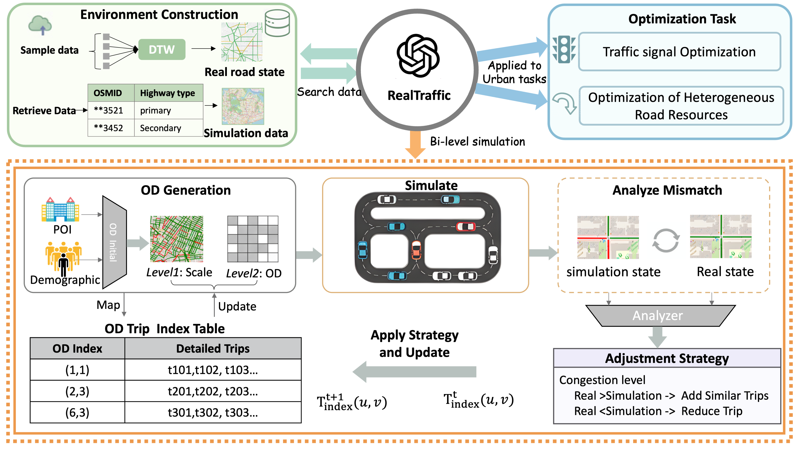
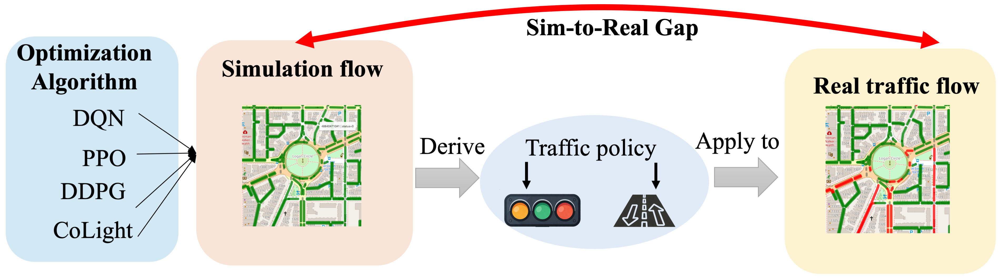

# RealTraffic: High-Fidelity Peak-Period Traffic Simulation for Arbitrary Regions via Congestion Maps

<p align="center">
  
  <br>
  <em>Figure 1: The overall framework of RealTraffic, illustrating the pipeline from data acquisition to bi-level calibration.</em>
</p>

This repository is the official implementation for the paper **"RealTraffic: High-Fidelity Peak-Period Traffic Simulation for Arbitrary Regions via Congestion Maps"**.

## 📖 Motivation

Reliable traffic simulation is crucial for urban planning and signal control, yet existing methods struggle with the "Gap between Reality and Simulation."

<p align="center">
  
  <br>
  <em>Figure 2: Motivation. Discrepancy between real-world congestion and traditional simulation.</em>
</p>

**RealTraffic** is a framework designed to bridge this gap. By leveraging OpenStreetMap for topology and Azure Maps for real-time congestion data, it enables high-fidelity simulation of peak-period traffic for arbitrary user-defined regions.


---


## 1. Prerequisites

- **Python**: 3.11+
- **SUMO**: You must install [SUMO](https://eclipse.dev/sumo/) and set the `SUMO_HOME` environment variable.
  - *Note: If `SUMO_HOME` is not set, the script will raise an error.*
- **PyTorch** (Optional): Required only for the **Optimization Mode**.
  ```bash
  pip install torch torchvision torchaudio

## 2. Installation

    
    git clone [https://github.com/pkucs-Ltf/RealTraffic.git](https://github.com/pkucs-Ltf/RealTraffic.git)
    cd RealTraffic
    pip install -r requirements.txt


## 3.Quick Start


**Mode A: Traffic Simulation**
Run the standard simulation calibrationn with default settings(Manhattan Region):

    
    python run.py -t simulation -c configs\\simu_Manha.yml


---

## 🛠️ Full Usage Workflow

RealTraffic supports two main task modes: **Regional Simulation** and **Traffic Optimization**.

### 📍 Mode 1: Regional Simulation - Generate High-Fidelity Traffic Flows

Regional simulation builds high-fidelity traffic flow environments for arbitrary urban areas. Two data acquisition approaches are supported:

#### Option A: Real-time Simulation

Suitable for quick testing and instant simulation needs. The system fetches live traffic data and runs simulation in real-time.

```bash
# Specify bounding box (lat/lon) for real-time data acquisition and simulation
# Format: --bbox <lat_min> <lon_min> <lat_max> <lon_max>
python run.py -t simulation --bbox 39.90 116.30 39.95 116.40 --realtime
```

#### Option B: Peak-Period Pattern Simulation ⭐ Recommended

This is the **primary approach discussed in our paper**. By collecting multi-day data and extracting stable commuting patterns, it generates higher-quality simulation environments.

**Step 1: Collect Multi-Day Traffic Data**

Collect traffic congestion information across multiple days during the same time window (sampled every 20 minutes):

```bash
# Collect data over multiple days (e.g., 5 consecutive days, morning peak 7:00-9:00)
# Specify bounding box coordinates
python scripts/collect_traffic_data.py \
    --bbox 39.90 116.30 39.95 116.40 \
    --days 5 \
    --time_window "07:00-09:00" \
    --interval 20 \
    --output data/my_region/raw_traffic
```

**Step 2: DTW Temporal Alignment**

Use DTW (Dynamic Time Warping) algorithm to align multi-day sequences and extract stable commuting patterns:

```bash
# Perform DTW alignment on multi-day data to extract stable patterns
python scripts/dtw_alignment.py \
    --input data/my_region/raw_traffic \
    --output data/my_region/aligned_pattern
```

**Step 3: Launch Simulation**

Run high-fidelity regional simulation using the processed data:

```bash
# Start simulation with configuration file
python run.py -t simulation -c configs/simu_my_region.yml
```

Example configuration file (`configs/simu_my_region.yml`):

```yaml
region:
  name: "my_region"
  data_path: "data/my_region/aligned_pattern"
  bbox: [39.90, 116.30, 39.95, 116.40]

simulation:
  duration: 3600  # Simulation duration (seconds)
  step_length: 1  # Simulation step size
  
calibration:
  enable: true
  max_iterations: 10
```

---

### 🎯 Mode 2: Traffic Optimization - Maximize Traffic Efficiency

Based on high-quality traffic flows, optimize road resource allocation to maximize traffic efficiency. Two optimization tasks are supported:

#### Optimization Task 1: Traffic Light Control (TLC)

Use reinforcement learning to optimize traffic signal timing strategies:

```bash
# Traffic light optimization with DQN algorithm
python run.py -t traffic_light_optimization -c configs/opti_task_TLC_Manha_dqn.yml

# Or use PPO algorithm
python run.py -t traffic_light_optimization -c configs/opti_task_TLC_Manha_ppo.yml
```

#### Optimization Task 2: Lane Change Coordination

Optimize vehicle lane-changing strategies to coordinate lane utilization:

```bash
# Launch lane change optimization task
python run.py -t lane_change_optimization -c configs/lane_change_task_DC.yml
```

---

### 📋 Task Mode Summary

| Mode Parameter `-t` | Task Type | Description |
|---------------------|-----------|-------------|
| `simulation` | Regional Simulation | Generate high-fidelity traffic flows for specified regions (default mode) |
| `traffic_light_optimization` | Traffic Light Control | Optimize signal timing based on existing traffic flows |
| `lane_change_optimization` | Lane Change Strategy | Optimize vehicle lane-changing decisions and coordination |

---

## 📂 Outputs

* **Simulation Mode**: Generates trip info and summary statistics.
* **Optimization Mode**: Creates a directory named `optimization_run_YYYYMMDD_HHMMSS/` containing model checkpoints and training logs.
